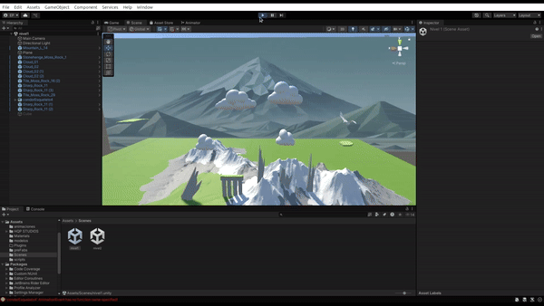
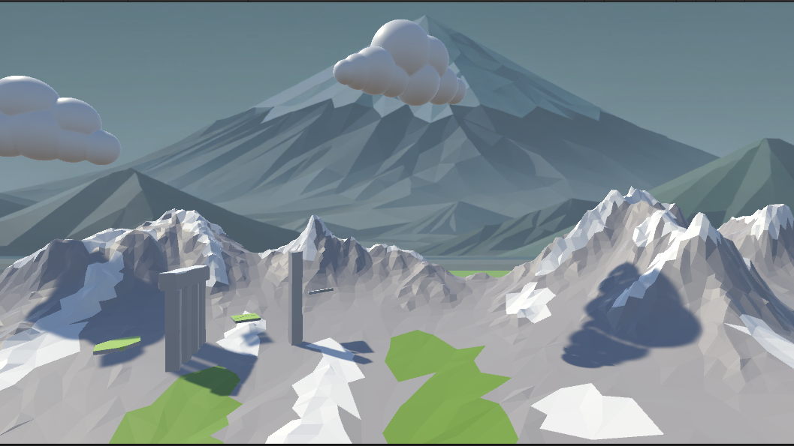

# Proyecto: Cóndor Pasa 🦅

**Cóndor Pasa** es un emocionante juego en el que controlas a un majestuoso cóndor que vuela a través de un desafiante paisaje lleno de volcanes, incluyendo el famoso volcán **Misti** de Arequipa, Perú. ¡Tu objetivo es navegar a través de los obstáculos y alcanzar la mayor distancia posible!

## 🖼️ Vista previa del juego



## 🎮 Características principales
- **Exploración aérea**: Controla un cóndor que vuela entre los volcanes en un entorno 2.5D.
- **Inspiración peruana**: El diseño del fondo incluye el icónico volcán Misti y paisajes montañosos de estilo minimalista.
- **Desafíos progresivos**: A medida que avanzas, los obstáculos se vuelven más difíciles.

## 🚀 Cómo jugar
1. **Inicia el juego**.
2. Usa las teclas de flechas (o los controles designados) para mover al cóndor.
3. Evita los obstáculos y trata de recorrer la mayor distancia posible.
4. ¡Comparte tu puntuación con tus amigos!

## 🛠️ Tecnologías utilizadas
- **Motor de juego**: Unity 2023.
- **Lenguaje de programación**: C#.
- **Arte y diseño**:
  - Fondo inspirado en paisajes minimalistas.
  - Volcán Misti y montañas en estilo low-poly.

## 🌟 Objetivo del proyecto
El proyecto tiene como finalidad:
- Resaltar la belleza de los paisajes peruanos a través de un juego interactivo.
- Ofrecer una experiencia de juego sencilla pero adictiva, basada en mecánicas de vuelo y obstáculos.

## 📥 Instalación
1. Clona este repositorio:
   ```bash
   git clone https://github.com/tu-usuario/CondorPasa.git
